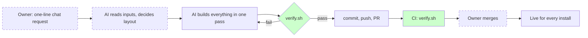

# AI Process Audit: Beyond Autopilot (the repo auditing itself)

Mode: **quick**. Audited commit: 4dae6e3. Date: 2026-09-11.

This is a live example of the `/audit` command run on the repo that ships it. It is deliberately left in the repo so anyone considering the audit can see what the output looks like on a small, young codebase. Inputs available: the repository with full history, all instruction files and config, CI config, and the one session transcript in which the repo was built. Not available: an issue tracker, owner-filled intake (a partial one was reconstructed from the session, see `OWNER-INTAKE.md`).

## Status (updated 2026-09-12)

All five recommendations and the stop-doing list were actioned the day after the audit. R1: the repo now installs its own payload (`scripts/sync-root.sh`, checked by `verify.sh`). R2: `bash-guard.js` with over 50 test cases, sharing SQL rules with the SQL guard. R3: `VERSION`, an install stamp, and a session-start hook. R4: an eval log and lessons log ship in the payload, `/review` appends to the eval log, and the golden task suite was adopted at `golden-tasks.md`. R5: `lessons.md` and `docs/decisions.md` exist and carry this session's lost knowledge. Drafts that were adopted have been removed from `drafts/`. The next re-audit diffs against `audit-scorecard.yaml` from this run.

## Executive summary

**Maturity: 5.1 / 10** against a target of 7 on the capabilities that compound. The process is young, not absent. Enforcement is unusually good for a two-day-old repo: a verification script runs in CI, it exercises the installer end to end, and it caught a real data-loss bug before it shipped. Everything the script can see is well controlled. Everything it cannot see is not controlled at all.

Three findings that matter:

1. **The repo does not run what it ships.** `/plan`, `/review`, `/lesson`, the permissions and the SQL guard are installed into every downstream project and into none of this repo's own sessions. The direct consequence is visible in the history: a 22-file change with no plan on disk, no review pass, and four defects found by trial rather than by the checklist the payload tells everyone else to use. Anti-pattern: none in the catalogue fits; call it **preaching, not practising**.
2. **Knowledge-type lessons are lost; validation-type lessons are kept.** Of five failures this session, three became verify-script checks and cannot recur. Two were knowledge (a test-runner quirk, a proxy limitation) and are recorded nowhere. The feedback loop is closed for what a script can assert and open for everything else. Anti-pattern: **Correction amnesia**, partial.
3. **The permission tiers are untested.** `settings.json` is 144 exact-string patterns checked only for being valid JSON. Whether `Bash(rm -rf *)` also covers `rm -r -f`, or `Bash(git push --force *)` covers `git push origin +main`, is not known and not tested. The SQL guard shows what the standard should be: a fail-closed hook with a test suite. Anti-pattern: **Verify by vibes**, confined to permissions.

Three changes, ranked: R1 install the payload at this repo's own root and have `verify.sh` assert it matches `config/`; R2 a tested shell-command guard hook alongside the SQL guard; R3 version stamps and a session-start self-check so a downstream repo can tell what it is running and whether the config is actually active.

Single biggest bottleneck: nothing measures whether a change to the payload makes downstream AI work better. Every change to `config/` is currently an opinion.

Monday: R1 takes an hour and unlocks the rest. Then create `lessons.md` with the two lost lessons from this session.

## Phase 1: Current process

Dashed: exists only as "the human does it in chat". Green: enforced by tooling. Plain: the AI does it because it remembered to.

Chain: request → build → verify.sh → PR → CI → merge → live. There is no plan stage, no independent review stage, no measurement stage, and no stage that captures a lesson.

## Phase 2: Diagnosis (Lenses A, D, E)

### Lens A: Context and knowledge architecture

**Placement is largely right.** The always-on file downstream is 45 lines `[evidence: config/CLAUDE.md]`. The 561-line audit is a command, loaded on demand `[evidence: config/.claude/commands/audit.md]`. The reason the payload sits under `config/` is written where the next session will read it `[evidence: CLAUDE.md:5, README.md]`. Severity: none.

**Duplicated content, low severity.** The full cloud install message appears in `README.md` and again in `docs/INSTALL.md`. The list of SQL classes the guard blocks appears in `README.md`, `SECURITY.md` and `docs/TROUBLESHOOTING.md`, in three different wordings `[evidence: README.md "SQL guard", SECURITY.md "What counts", TROUBLESHOOTING.md table]`. The authoritative source is `sql-guard.js` and its tests; the docs should say less and point there. Anti-pattern: **Duplicated rule**.

**Memory: what is lost at session end.** Kept: the `config/` decision, the rename-proof tar decision (comment in `install.sh`). Lost: that the cloud proxy refuses repository-settings writes (tried, failed, nowhere recorded); that `node --test <dir>` does not work on Node 22 (fixed in `verify.sh`, reason not recorded); that a licence was deliberately deferred; that re-cloning after a rename was considered and rejected. Severity: medium. Each of these will cost a future session the same minutes again.

### Lens D: Verification and review

| Check | Kind | Enforced? |
| --- | --- | --- |
| `settings.json` parses | Independent | Yes, CI |
| SQL guard test suite (26 cases) | Independent | Yes, CI |
| `install.sh` syntax | Independent | Yes, CI |
| Command frontmatter present | Independent | Yes, CI |
| Em dash scan | Independent | Yes, CI |
| Installer end to end, twice, against the PR's own payload | Independent | Yes, CI |
| CI as a required status on `main` | | **Not visible**; no branch protection observed [inferred: absent] |
| Permission patterns cover what the README's tiers claim | | **Absent** |
| Hook matcher regex matches the tool names it is meant for | | **Absent** (testable in five lines) |
| Payload under `config/` matches what runs at the root | | **Absent**, nothing runs at the root |
| `/review` pass on this repo's own changes | Self | **Absent**, command not available here |
| Human review of the diff | Human | Not visible |

Severity high: the permission tiers. The README makes a promise per tier `[evidence: README.md "What each permission tier does"]` and nothing checks it. Claude Code's pattern semantics are not fully documented, so the honest control is not a pattern test but a hook that normalises the command and decides, with its own tests, the way `sql-guard.js` does for SQL.

Human attention map: today the owner's attention goes to merging. It should go to reading the two or three lines of `config/CLAUDE.md` or `settings.json` that changed, because those lines change AI behaviour everywhere. Everything else is already machine-checked.

### Lens E: Feedback loops

Traced instances (AI mistake → correction → remembered?):

| Mistake | Corrected by | Remembered? |
| --- | --- | --- |
| Installer re-run wiped the Project section (F-01) | verify.sh run, then code fix | **Yes**: verify.sh asserts a filled-in Project section survives a re-run |
| verify.sh tarball missed untracked files (F-02) | reading the failure | **Yes**: fixed in verify.sh, runs in CI |
| `node --test tests/` treated the directory as a test and failed (F-03) | reading the failure | **Partly**: fixed in verify.sh; nothing says why, a contributor can reintroduce it |
| Em dash scan contained an em dash (F-04) | CI-equivalent check flagged it | **Yes**: byte-escaped pattern |
| Tried to rename the repo through the GitHub API; proxy refused (F-05) | tool error | **No**: recorded nowhere |

Mechanisms that exist to convert corrections into controls: `verify.sh` (used, effective), `/lesson` (shipped, unavailable on this repo), `CHANGELOG.md` (used, but records changes, not lessons). The loop is closed for validation-type failures and open for knowledge-type failures. Severity: medium now, high as the repo grows.

## Phase 3: Failure forensics

| # | What happened | Evidence | Type | Root cause | Control that would have prevented it | Cost |
| --- | --- | --- | --- | --- | --- | --- |
| F-01 | Installer's second run recognised its own `CLAUDE.md` and overwrote it, deleting the filled-in Project section. Docs already claimed the section was preserved | transcript: verify run showing `count=0`; fix in commit cec8018 `install.sh` | hallucinated project behaviour, failed to test | missing validation | An end-to-end re-run test written before the docs claimed the behaviour. Now exists | 15 min |
| F-02 | `verify.sh` built its fixture tarball from `git ls-files`, omitting untracked files, so new commands were "missing" | transcript; commit cec8018 `scripts/verify.sh` | failed to test | missing validation | Same as above; the validator needed one honest run before being trusted | 5 min |
| F-03 | `node --test tests/` fails on Node 22; the directory itself was reported as one failing test | transcript | inconsistent implementation | missing context | A note in `CONTRIBUTING.md` or a lesson row; or simply that `verify.sh` is the only documented entry point (it now is) | 5 min |
| F-04 | The em dash check in `CONTRIBUTING.md` contained a literal em dash and flagged itself | transcript | repeated mistake | poor instruction | A check that cannot contain its own trigger (byte escape). Now exists | 3 min |
| F-05 | Attempted the repo rename via the GitHub API after a probe suggested auth was available; the proxy refused settings writes. The owner did it by hand | transcript | excessive human intervention | missing tool, then missing feedback loop | A one-line lesson recorded where the next session reads it | 5 min, plus owner time |
| F-06 | A 22-file rebrand was built with no plan on disk and no independent review pass, in the repo that mandates both for everyone else | commit cec8018; `docs/plans/` absent; `.claude/commands/` absent at root | unbounded task | missing feedback loop (the payload's own rules were not applied here) | Install the payload at this repo's root | none visible yet; the four defects above are the likely cost |

Root cause histogram: missing validation 2, missing feedback loop 2, missing context 1, poor instruction 1, missing tool 1. The order of recommendations follows it: validation and feedback loops first.

## Phase 4: Maturity (compressed)

More than half the capabilities would score 3 or below on a two-day-old repo, so the table is replaced by this paragraph, per the compression rule. What exists and is enforced: independent verification of the guard and installer (7), repository context for downstream repos (6), guardrails for SQL (7) and for permissions (4, untested). What exists and is informal: documentation maintenance (5, thorough but duplicated), continuous improvement (4, a changelog and an intent). What is absent: planning, acceptance criteria, independent review on this repo, memory of knowledge-type lessons, evaluation, observability. Weighted overall **5.1**, pulled up by verification and down by evaluation and feedback loops, both of which weigh double. See `audit-scorecard.yaml`.

## Phase 5: Recommendations

### R1. Run what you ship

- **Problem**: this repo's sessions have none of the payload `[evidence: no .claude/ at root; F-06]`.
- **Change**: install the payload at the root (`.claude/` and merge the payload rules into `CLAUDE.md`), keep `config/` as the source, and add one check to `verify.sh`: every file under `config/.claude/` is byte-identical to its root copy. The payload's deny on editing `.claude/` then protects the running copy while `config/` stays editable, which is exactly the split the README already describes.
- **Mechanism**: the repo becomes its own first downstream project. Every rule is felt by its author before it ships.
- **Effort**: 1 hour. **Risk**: low; the verify check makes drift impossible.
- **Measure**: plans in `docs/plans/` per non-trivial PR, baseline 0 of 2, target 1 of 1 within a month.

### R2. A shell-command guard with tests

- **Problem**: the "Blocked" tier is a list of exact patterns with no test `[evidence: config/.claude/settings.json deny; Lens D]`. Whether `rm -r -f`, `git push origin +main`, `git push --force-with-lease`, or `supabase db reset --linked` are caught is unknown.
- **Change**: `config/.claude/hooks/bash-guard.js`, a PreToolUse hook on `Bash` that tokenises the command, normalises flags, and blocks the destructive classes the README promises, fail-closed, with a test file like the SQL guard's. Keep the deny list as a first line; the hook is the one that is tested.
- **Mechanism**: converts a promise into a check. Same design as the guard that already works.
- **Effort**: half a day. **Risk**: false positives on legitimate commands; mitigated by the test suite and an `ask` rather than `deny` outcome for ambiguous cases.
- **Measure**: blocked-class commands reaching a shell in downstream repos, baseline unknown, target 0; test count for the hook, target 30 or more.

### R3. Version stamp and session-start self-check

- **Problem**: a downstream repo cannot tell which payload it runs, whether the config is active, or whether the Project section was ever filled in. The number one support question will be "it still prompts" `[evidence: docs/TROUBLESHOOTING.md first section exists because of this]`.
- **Change**: tag releases; the installer writes `.claude/autopilot.json` (version, source, installed at); a `SessionStart` hook prints the version and warns if Node is missing, the hook is not executable, or `## Project` still holds the template comment.
- **Mechanism**: moves "is it working?" from a manual test in the README to something every session reports.
- **Effort**: 3 hours. **Risk**: low.
- **Measure**: troubleshooting questions about inactive config, baseline not visible, target 0.

### R4. Measure the payload

- **Problem**: nothing says whether a change to `config/` helped `[evidence: no eval log, no golden tasks; Lens E]`. Anti-pattern: **Unmeasured process**.
- **Change**: ship `docs/ai-process-audit/eval-log.md` in the payload; have `/review` append a row when it finishes (first pass, iterations, interventions, tests failed); adopt the golden task suite in `drafts/golden-tasks.md` for this repo and run it before and after any change to `config/CLAUDE.md` or the commands.
- **Mechanism**: the audit's re-audit mode then has numbers to compare.
- **Effort**: 2 hours to set up, 10 minutes per payload change thereafter. **Risk**: the log is ignored; mitigated by `/review` writing it.
- **Measure**: eval log rows per downstream task, target 1 per task; first-pass rate trend over 60 days.

### R5. Keep knowledge-type lessons

- **Problem**: F-03 and F-05 are recorded nowhere `[evidence: Lens E table]`.
- **Change**: create `docs/ai-process-audit/lessons.md` now with those two rows; with R1 in place, `/lesson` maintains it. Add a `docs/decisions.md` with the four decisions made this session (payload under `config/`; wildcard extraction; licence deferred; rename is manual), one paragraph each. Not ADRs with ceremony, one file.
- **Mechanism**: the next session reads the file before repeating the mistake.
- **Effort**: 30 minutes. **Risk**: none.
- **Measure**: repeated mistakes across sessions, baseline 0 observed (one session), target 0.

### Stop doing

- Stop repeating the full four-step cloud install message in `README.md`; keep the one-liner and link to `docs/INSTALL.md`.
- Stop listing the SQL classes the guard blocks in three documents; state it once, in `SECURITY.md`, and point at the tests as the authoritative list.
- Stop listing installed files by hand in `docs/INSTALL.md`; the installer prints them.
- Stop making 22-file changes without a plan file, in this repo of all places.

### Drafts

- `drafts/CLAUDE.md`: the proposed root instruction file for this repo once R1 is done.
- `drafts/golden-tasks.md`: six repeatable tasks for this repo with objective success criteria.

## Phase 6: Self-check

Every score above cites evidence or is marked inferred. Every recommendation traces to a numbered failure or lens finding. No multi-agent, no extra personas, no "more prompts" (R4 extends an existing command rather than adding one). The order R1 to R5 follows the histogram: feedback loop and validation first. The stop-doing list is non-empty. Main body is under 2,000 words.

## Questions for the owner

See `QUESTIONS-FOR-OWNER.md`.
